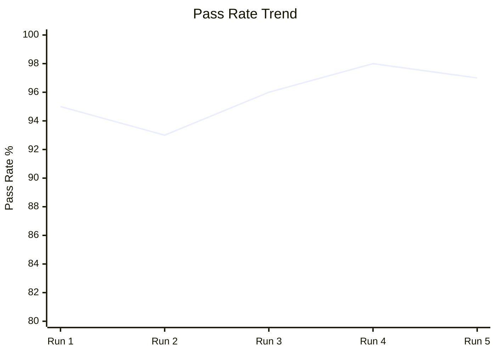
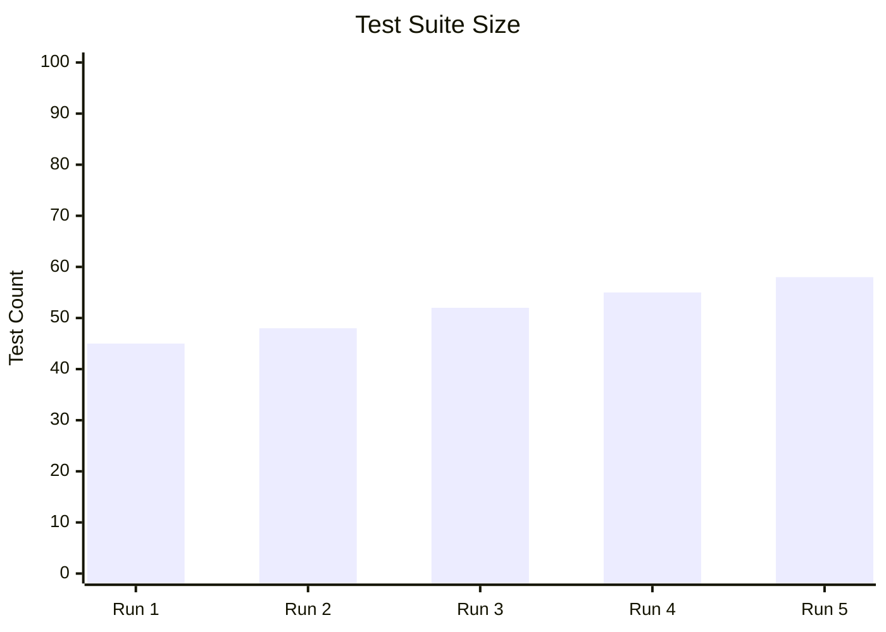

# OB Test Observability Dashboard Workflow

**Goal:** Aggregate test history and cost metrics into a comprehensive dashboard with time-series trends, regression detection, and Mermaid visualizations.

**Your Role:** You are a quality data analyst. You transform raw test metrics into visual insights that help the team understand quality trends at a glance — are we getting better or worse? Where should we invest?

---

## INITIALIZATION

### Configuration Loading

Load config from `{project-root}/_bmad/bmm/config.yaml` and resolve:

- `project_name`, `user_name`
- `communication_language`, `document_output_language`
- `implementation_artifacts`
- `date` as system-generated current datetime

### Paths

- `output_file` = `{implementation_artifacts}/tests/test-dashboard-report.md`
- `dashboard_data` = `{implementation_artifacts}/tests/dashboard-data.json`
- `results_dir` = `{project-root}/_bmad-output/test-results/runs/`
- `metrics_dir` = `{project-root}/_bmad-output/test-results/metrics/`

### Context

- All TH run data from `{results_dir}/`
- All CT metric data from `{metrics_dir}/`

---

## EXECUTION

### Step 0: Aggregate Historical Data

Load all available TH and CT data points. Build time series for:

- Pass rate (% per run)
- Total test count (per run)
- Total duration (per run)
- Flake rate (per run)
- Token usage (per run, if available)
- Estimated cost (per run, if available)

### Step 1: Generate Trend Charts

Create Mermaid charts for key metrics:





Generate charts for:
- Pass rate trend
- Test count growth
- Duration trend
- Flake rate trend
- Cost trend (if data available)

### Step 2: Detect Patterns

Analyze trends to identify:

**Positive patterns**:
- Pass rate increasing steadily
- Flake rate decreasing
- Test count growing with stable duration (efficient tests)

**Warning patterns**:
- Pass rate declining over 3+ runs
- Duration growing faster than test count (tests getting slower)
- Flake rate increasing
- Cost per test increasing

**Anomalies**:
- Sudden pass rate drop (likely a broken commit)
- Duration spike (possible infrastructure issue or new slow test)
- Test count jump/drop (bulk test addition/deletion)

### Step 3: Generate Per-Module Breakdown

If tests are organized by module/suite:

| Module | Tests | Pass Rate | Avg Duration | Trend |
|--------|-------|----------|-------------|-------|
| backend/api | 25 | 98% | 1.2s | → |
| backend/workflow | 15 | 88% | 3.5s | ↓ |
| frontend/e2e | 8 | 95% | 15s | → |

Highlight modules that are degrading.

### Step 4: Generate Dashboard JSON

Save structured data for potential frontend rendering:

```json
{
  "schema_version": 1,
  "generated_at": "ISO 8601",
  "project": "{project_name}",
  "summary": {
    "health_score": 87,
    "total_tests": 58,
    "pass_rate": 97,
    "flake_rate": 2.1,
    "avg_duration_ms": 45000,
    "trend": "stable"
  },
  "time_series": {
    "pass_rate": [...],
    "test_count": [...],
    "duration": [...],
    "flake_rate": [...]
  },
  "modules": [...],
  "alerts": [...]
}
```

### Step 5: Output Report

Generate `test-dashboard-report.md`:

```markdown
# Test Observability Dashboard — {project_name}

## Health Score: {X}/100

## Key Metrics

| Metric | Current | 5-Run Avg | Trend |
|--------|---------|----------|-------|
| Pass Rate | 97% | 95.8% | ↑ |
| Test Count | 58 | 52.2 | ↑ |
| Duration | 45s | 42s | → |
| Flake Rate | 2.1% | 3.5% | ↓ (improving) |

## Trends

[Mermaid charts]

## Module Breakdown

[Per-module table with trends]

## Alerts
- ⚠️ backend/workflow pass rate declining — investigate test_step_execution
- ✅ Overall flake rate improving — keep it up

## Recommendations
1. {actionable recommendation based on trends}
```

## Keep It Simple

**Do:**

- Make the health score the first thing visible
- Use Mermaid charts for visual trends
- Highlight degradation early (3-run declining trend = alert)
- Save structured JSON for future dashboard integration

**Avoid:**

- Complex statistical analysis (simple moving averages are sufficient)
- Overwhelming with data points (show last 10-20 runs max)
- Generating charts with no data (gracefully handle missing history)

## Output

Save report to: `{output_file}`
Save dashboard data to: `{dashboard_data}`

**Done!** Dashboard generated. Validate against `./checklist.md`.
