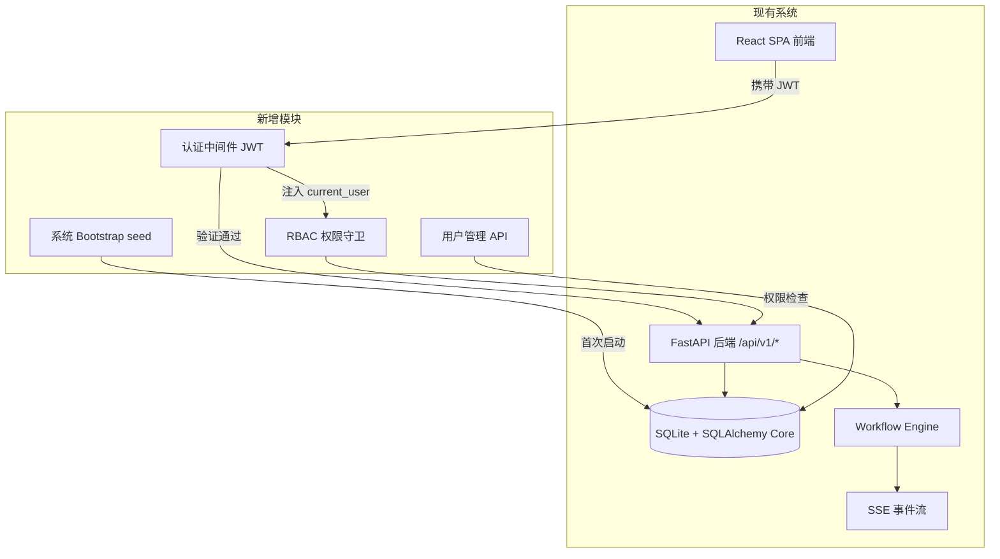
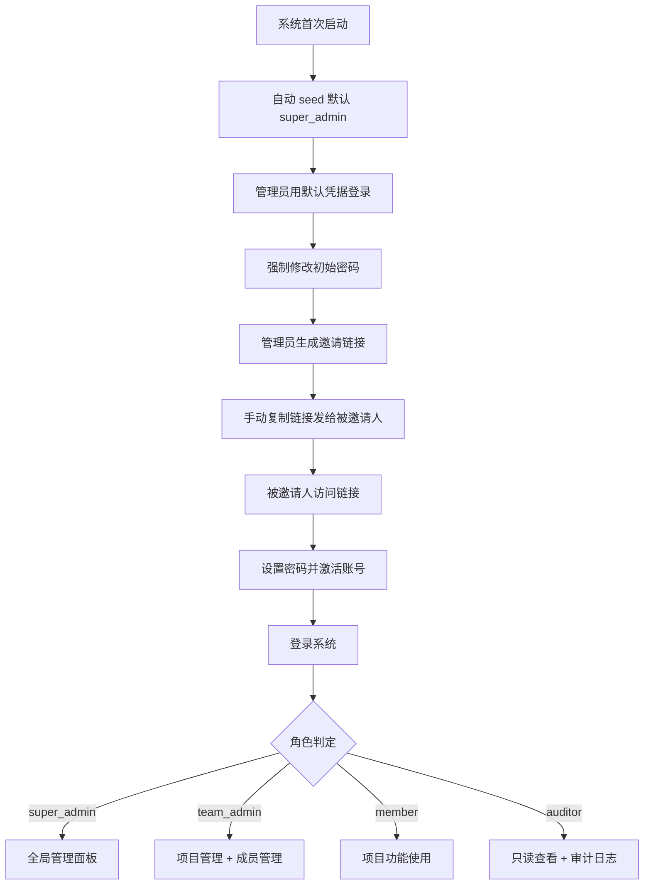
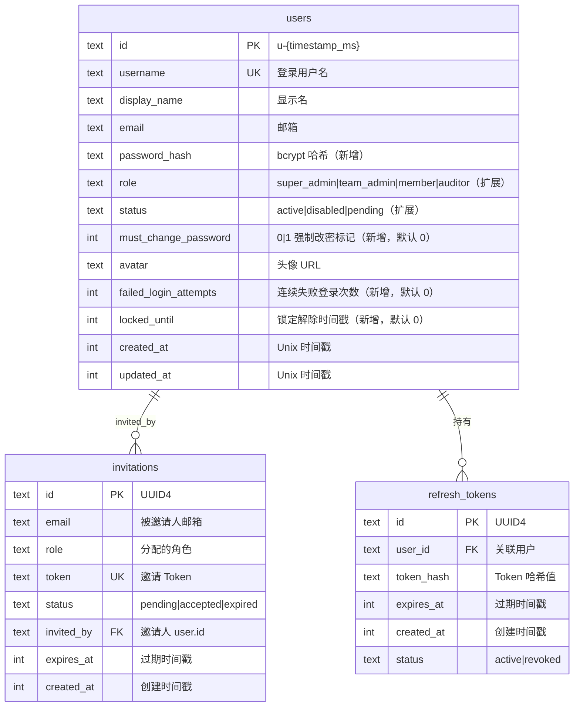
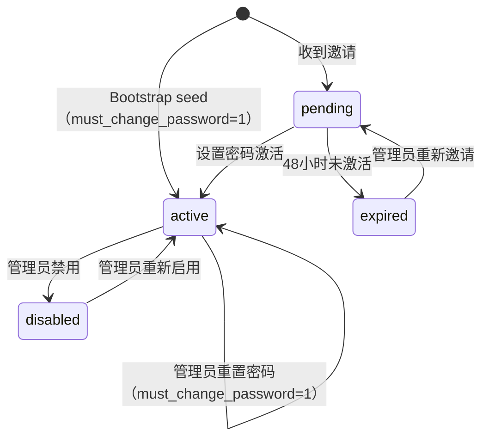
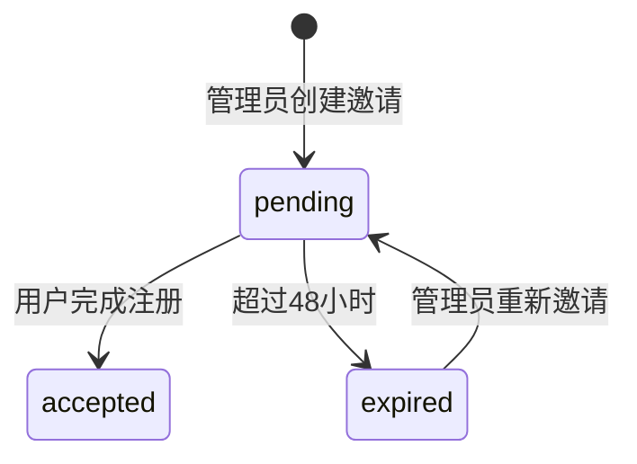
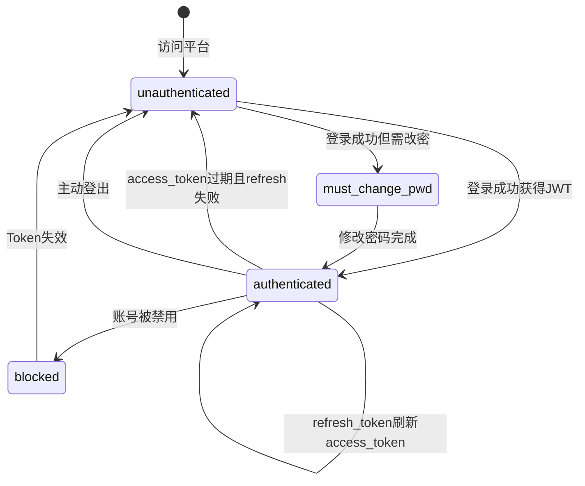

# 新增用户管理模块 — 产品需求文档

> **摘要**：为零鉴权的 AI-DZHT 平台引入 JWT 双令牌认证 + 四级 RBAC 权限体系，支撑 50+ 人团队安全协作。

**版本**: v2.0 | **日期**: 2026-04-21 | **作者**: Lena（需求总监 Agent）

---

## 1. 执行摘要

为即将面向 50+ 人研发团队开放的 AI-DZHT 平台，从零搭建完整用户鉴权与权限管理体系：系统 bootstrap 自动 seed 管理员、邀请注册、JWT 双令牌认证、四级 RBAC（super_admin / team_admin / member / auditor）、用户全生命周期管理及前端用户管理模块，消除当前所有 API 裸奔的安全风险。[✓ 用户确认]

---

## 2. 业务背景与目标

### 2.1 业务动机

AI-DZHT 当前 **完全无鉴权**：所有 API 端点公开可访问，任何知道地址的人都能创建项目、修改需求、操控 Agent 执行。[✓ 代码审查确认]

平台即将面向 **50+ 人研发团队**内部开放使用 [✓ 用户确认]，继续无鉴权将导致：

1. **数据安全风险**：任何人可读写全部项目数据，包括 LLM API Key 等敏感配置
2. **操作不可追溯**：无法区分"谁做了什么"，Agent 执行审批形同虚设
3. **协作混乱**：多人同时操作无法隔离权限，误操作无法归责

**现有基础设施盘点（代码审查）**：

| 组件 | 现状 | 代码位置 |
|------|------|---------|
| `users` 表 | 有 id/username/display_name/email/role/status/avatar/created_at/updated_at，**无 password 字段** | `database.py:221-233` |
| 用户 CRUD API | 完整 REST 端点 `/api/v1/users`，含 list/get/create/patch/delete/disable/enable | `routers/users.py` |
| 角色定义 | `admin \| member \| viewer`，**未在任何端点强制执行** | `models.py:556` |
| 项目关联 | `projects` 有 `owner_id` + `member_ids`，**不验证权限** | `database.py:59-60` |
| Mock 用户 | 4 个硬编码种子用户 u1-u4 | `database.py:1027-1041` |
| 前端用户设施 | `TEAM_MEMBERS` 硬编码 mock，无登录页、无用户管理页 | `types/project.ts:34-39` |
| 认证中间件 | **不存在**（main.py 仅有 CORS 中间件） | `main.py:36-41` |

### 2.2 成功指标（KPI）

| 指标 | 当前基线 | 目标值 | 度量方式 |
|------|---------|--------|---------|
| 未授权 API 访问事件数 | 无统计（全部开放） | 0 次/月 | HTTP 401/403 响应后无绕过成功记录 [◐ AI 推断] |
| 用户从收到邀请到完成首次登录耗时 | N/A | ≤ 5 分钟 | 邀请创建时间戳 → 首次登录时间戳 [◐ AI 推断] |
| 管理员完成一次用户 CRUD 操作耗时 | N/A | ≤ 30 秒 | 前端操作埋点 [◐ AI 推断] |
| API 鉴权中间件对请求延迟影响 | 0ms（无鉴权） | ≤ 15ms P99 | 中间件前后时间戳差值 [◐ AI 推断] |

### 2.3 与现有系统的关系

**关键集成点：**

| 现有模块 | 集成方式 | 影响范围 |
|---------|---------|---------|
| `app/main.py` | 新增 JWT 中间件、注册 auth/users 路由 | 所有请求经过鉴权 |
| `app/routers/*.py` | 每个路由函数注入 `current_user` 依赖，按角色过滤数据 | 所有现有端点需改造 |
| `app/database.py` | `users` 表扩展字段、新增 `invitations` / `refresh_tokens` 表；启动时 seed 默认 super_admin | 向后兼容，新字段有默认值 |
| `app/storage.py` | 新增认证相关存储函数 | 纯增量，不改现有函数签名 |
| `app/workflow_engine.py` | Agent 执行记录 `triggered_by` 用户 ID | 增强可追溯性 |
| 前端路由 | 新增登录页、用户管理页、未授权拦截、角色条件渲染 | 新增页面 + 现有页面权限适配 |

---

## 3. 用户画像与使用场景

### 3.1 角色定义

| 角色 | 代码标识 | 职责 | 使用频率 | 核心诉求 |
|------|---------|------|---------|---------|
| 超级管理员 | `super_admin` | 平台全局管理：用户邀请/CRUD、角色分配、系统配置、重置用户密码 | 每日 | 安全可控、操作高效 |
| 团队管理者 | `team_admin` | 管理所属项目的成员与 Agent 配置、创建项目、审批节点、邀请用户（限 team_admin/member/auditor） | 每日 | 团队协作顺畅、权限灵活 |
| 普通成员 | `member` | 在被分配的项目内使用功能、触发流水线、查看执行结果 | 每日 | 快速上手、不被权限阻碍 |
| 审计员 | `auditor` | 全局只读查看所有项目数据，访问审计日志 | 每周 | 完整操作记录、可追溯 |

[✓ 用户确认] 四级角色，团队 50+ 人。

**权限矩阵：**

| 操作 | super_admin | team_admin | member | auditor |
|------|:-----------:|:----------:|:------:|:-------:|
| **用户管理** | | | | |
| 邀请用户 | ✅ 可邀请所有角色 | ✅ 仅 team_admin/member/auditor | ❌ | ❌ |
| 禁用/启用账号 | ✅ | ❌ | ❌ | ❌ |
| 修改用户角色 | ✅ | ❌ | ❌ | ❌ |
| 删除用户 | ✅ | ❌ | ❌ | ❌ |
| 重置用户密码 | ✅ | ❌ | ❌ | ❌ |
| **项目管理** | | | | |
| 创建项目 | ✅ | ✅ | ❌ | ❌ |
| 管理项目成员 | ✅ 全部项目 | ✅ 自己的项目 | ❌ | ❌ |
| 查看项目 | ✅ 全部 | ✅ 自己参与的 | ✅ 自己参与的 | ✅ 全部（只读） |
| **需求/流水线操作** | | | | |
| 创建/编辑需求 | ✅ | ✅ | ✅ 自己参与的项目 | ❌ |
| 审批流水线节点 | ✅ | ✅ | ✅ 被指派时 | ❌ |
| **系统管理** | | | | |
| 系统设置 | ✅ | ❌ | ❌ | ❌ |
| 查看审计日志 | ✅ | ❌ | ❌ | ✅ |
| Agent 配置管理 | ✅ | ✅ | ❌ | ❌ |

[✓ 用户确认]

**邀请权限边界规则（R-001）**：`team_admin` 创建邀请时，可选角色范围为 `team_admin | member | auditor`。尝试邀请 `super_admin` 角色时，后端返回 HTTP 403。仅 `super_admin` 可邀请所有角色（含 `super_admin`）。[✓ 用户确认]

### 3.2 核心使用场景

**场景 S-0：系统首次启动 bootstrap（P0-MVP）**
- **触发条件：** 系统首次启动，数据库 `users` 表为空
- **正常流程：** 应用启动 → 检测到 `users` 表无记录 → 自动 seed 一个默认超级管理员账号（用户名 `admin`，初始密码 `Admin@2024`） → 记录到日志
- **成功结果：** 管理员可使用默认凭据登录系统，登录后系统强制要求修改密码
- **安全考量：** 默认凭据仅用于首次登录，强制修改后初始密码即失效
- [✓ 用户确认]

**场景 S-1：超级管理员/团队管理者邀请新用户（P0-MVP）**
- **触发条件：** 团队有新成员需要加入平台
- **正常流程：** 管理员进入用户管理页 → 点击"邀请用户" → 填写邮箱和角色 → 系统校验角色范围（team_admin 不可选 super_admin） → 系统生成邀请链接 → **管理员手动复制链接发给被邀请人**
- **成功结果：** 被邀请人通过链接设置密码并激活账号，以指定角色登录系统
- [✓ 用户确认]

**场景 S-2：用户登录系统（P0-MVP）**
- **触发条件：** 用户打开平台页面
- **正常流程：** 访问任意页面 → 未携带有效 JWT → 重定向到登录页 → 输入用户名/密码 → 验证通过 → 颁发 JWT → 跳转原目标页
- **成功结果：** 用户获得与其角色匹配的功能权限
- [◐ AI 推断]

**场景 S-3：RBAC 权限拦截（P0-MVP）**
- **触发条件：** 用户尝试访问超出角色权限的资源
- **正常流程：** 请求 → JWT 中间件解析身份 → RBAC 守卫检查权限矩阵 → 权限不足 → 返回 403
- **成功结果：** 操作被阻止，前端不显示无权限的按钮/菜单
- [◐ AI 推断]

**场景 S-4：管理员管理用户（P0-MVP）**
- **触发条件：** 需要查看/编辑/禁用/启用用户
- **正常流程：** 管理员进入用户管理页 → 查看用户列表 → 修改角色/禁用账号
- **成功结果：** 被禁用用户立即无法访问系统，角色变更实时生效
- [◐ AI 推断]

**场景 S-5：管理员重置用户密码（P0-MVP）**
- **触发条件：** 用户忘记密码，向管理员求助
- **正常流程：** 超级管理员进入用户管理页 → 找到目标用户 → 点击"重置密码" → 系统生成 12 位临时密码 → 管理员将临时密码告知用户 → 用户使用临时密码登录后强制修改密码
- **成功结果：** 用户恢复系统访问权限，原密码失效
- [✓ 用户确认]

**场景 S-6：审计员查看操作日志（P1-第二期）**
- **触发条件：** 安全审查或问题追溯
- **正常流程：** 审计员进入审计日志页 → 按时间/用户/操作类型筛选 → 查看详情
- **成功结果：** 获得完整操作轨迹
- [◐ AI 推断]

**场景 S-7：用户修改个人信息（P1-第二期）**
- **触发条件：** 用户需要更新头像、显示名或密码
- **正常流程：** 用户点击头像 → 个人设置 → 修改并保存；修改密码需验证当前密码
- **成功结果：** 信息即时更新
- [◐ AI 推断]

### 3.3 用户旅程

---

## 4. 功能需求

### 4.1 功能清单

| ID | 功能名称 | 描述 | 优先级 | 关联场景 |
|----|---------|------|--------|---------|
| F-001 | 用户邀请注册 | 管理员生成邀请链接（手动复制分享），被邀请人通过链接设置密码激活。team_admin 不可邀请 super_admin 角色 | MVP | S-1 |
| F-002 | 用户名密码登录 | JWT 双令牌认证：access_token (15min) + refresh_token (7天) | MVP | S-2 |
| F-003 | JWT 认证中间件 | 全局请求拦截，验证 JWT，注入当前用户上下文 | MVP | S-2, S-3 |
| F-004 | RBAC 权限守卫 | 基于权限矩阵的端点级权限控制，依赖注入模式 | MVP | S-3 |
| F-005 | 用户 CRUD 管理 | 管理员查看用户列表、编辑角色、禁用/启用/删除账号 | MVP | S-4 |
| F-006 | 密码安全策略 | bcrypt 哈希存储、≥8 字符含大小写+数字、5 次失败锁定 30 分钟 | MVP | S-0, S-1, S-2 |
| F-007 | 会话管理 | Token 刷新、主动登出、Token 黑名单 | MVP | S-2 |
| F-008 | 前端登录页 | 登录表单、错误提示、JWT 存储与自动携带 | MVP | S-2 |
| F-009 | 前端用户管理页 | 用户列表、邀请对话框、角色管理、启用禁用、重置密码 | MVP | S-1, S-4, S-5 |
| F-010 | 前端权限适配 | 替换 TEAM_MEMBERS mock、角色条件渲染、未授权拦截 | MVP | S-3 |
| F-011 | 项目成员管理 | 项目级成员添加/移除，控制数据访问范围 | 第二期 | — |
| F-012 | 审计日志 | 记录写操作，支持查询筛选 | 第二期 | S-6 |
| F-013 | 个人信息管理 | 用户自助修改显示名、头像、密码 | 第二期 | S-7 |
| F-014 | 多设备会话管理 | 查看活跃会话、踢出其他设备 | 第二期 | — |
| F-015 | 系统 Bootstrap | 首次启动时自动 seed 默认超级管理员（用户名 `admin`），首次登录后强制修改密码 | MVP | S-0 |
| F-016 | 管理员重置用户密码 | super_admin 可为任意用户生成 12 位临时密码，用户下次登录强制修改 | MVP | S-5 |

### 4.2 用户故事

**US-001：邀请用户加入平台**
As a 超级管理员/团队管理者, I want 通过生成邀请链接并手动分享给目标用户, so that 只有经过授权的人才能访问平台。

**US-002：通过邀请链接激活账号**
As a 被邀请用户, I want 通过邀请链接设置密码并激活账号, so that 我可以安全地开始使用平台。

**US-003：用户名密码登录**
As a 已注册用户, I want 使用用户名和密码登录系统, so that 我可以访问授权范围内的功能。

**US-004：刷新访问令牌**
As a 已登录用户, I want 在 access_token 过期时自动用 refresh_token 获取新令牌, so that 我不需要频繁重新登录。

**US-005：管理员管理用户**
As a 超级管理员, I want 查看所有用户、修改角色、禁用/启用/删除账号, so that 我可以维护平台用户安全。

**US-006：RBAC 权限拦截**
As a 平台系统, I want 根据用户角色和权限矩阵自动拦截未授权的 API 请求, so that 数据安全策略被后端强制执行。

**US-007：主动登出**
As a 已登录用户, I want 主动退出登录并使当前令牌失效, so that 离开时账号不会被冒用。

**US-008：前端权限适配**
As a 任意角色用户, I want 登录后只看到我有权操作的功能和数据, so that 界面清晰不混乱。

**US-009：系统首次启动可用**
As a 平台部署者, I want 系统首次启动时自动创建默认管理员账号, so that 我不需要手动操作数据库就能开始使用系统。

**US-010：管理员帮用户重置密码**
As a 超级管理员, I want 为忘记密码的用户重置密码, so that 用户可以恢复系统访问而不需要自助邮件找回。

### 4.3 验收标准

**AC-001：邀请注册流程** — 关联 US-001, US-002

| # | Given | When | Then |
|---|-------|------|------|
| a | 超级管理员已登录 | 在用户管理页填写目标邮箱、选择任意角色，点击"生成邀请链接" | 系统创建 `invitations` 记录（状态 `pending`，有效期 48 小时），页面显示可复制的邀请链接 |
| b | 团队管理者已登录 | 在用户管理页填写目标邮箱、选择 `member` 角色，点击"生成邀请链接" | 系统创建邀请记录，角色为 `member` |
| c | 团队管理者已登录 | 在用户管理页尝试选择 `super_admin` 角色邀请用户 | 后端返回 HTTP 403，提示"团队管理者不能邀请超级管理员角色" [✓ 用户确认] |
| d | 被邀请人持有有效邀请链接 | 访问链接并设置符合策略的密码（≥8 字符，含大小写字母+数字） | 用户记录创建（角色为邀请时指定，状态 `active`），邀请记录标记 `accepted`，自动登录跳转首页 |
| e | 邀请链接已过期（超过 48 小时） | 被邀请人访问该链接 | 页面提示"邀请已过期，请联系管理员重新邀请"，不创建用户 |
| f | member 或 auditor 角色用户 | 尝试访问邀请用户接口 | 返回 HTTP 403 |

**AC-002：登录认证** — 关联 US-003

| # | Given | When | Then |
|---|-------|------|------|
| a | 已激活用户 | 提交正确用户名和密码到 `POST /api/v1/auth/login` | 返回 `access_token`（15 分钟）和 `refresh_token`（7 天），HTTP 200 |
| b | 已激活用户 | 连续 5 次提交错误密码 | 第 6 次返回 HTTP 429，提示"登录尝试过于频繁，请 30 分钟后重试" |
| c | 账号状态为 `disabled` | 提交正确凭据 | 返回 HTTP 403，提示"账号已被禁用，请联系管理员" |
| d | 不存在的用户名 | 提交登录请求 | 返回 HTTP 401，提示"用户名或密码错误"（不泄露用户是否存在） |
| e | 用户标记为 `must_change_password` | 登录成功后 | 返回正常 JWT 但附加 `must_change_password: true` 标记，前端强制跳转修改密码页面，修改完成前拦截所有其他操作 |

**AC-003：JWT 中间件** — 关联 US-003, US-006

| # | Given | When | Then |
|---|-------|------|------|
| a | 请求未携带 Authorization header | 访问需认证的 API 端点 | 返回 HTTP 401，`{"detail": "未提供认证凭据"}` |
| b | 请求携带已过期的 access_token | 访问需认证的 API 端点 | 返回 HTTP 401，`{"detail": "认证已过期"}` |
| c | `/health`、`/api/v1/auth/login`、`/api/v1/auth/register` | 未携带 JWT 访问 | 正常响应，不做认证拦截 |
| d | 请求携带有效 JWT | 访问任何 API 端点 | 解析出 `current_user` 注入请求上下文 |

**AC-004：RBAC 权限控制** — 关联 US-006

| # | Given | When | Then |
|---|-------|------|------|
| a | `member` 角色用户 | `DELETE /api/v1/users/{other_user_id}` | 返回 HTTP 403 |
| b | `auditor` 角色用户 | `POST /api/v1/projects` | 返回 HTTP 403 |
| c | `team_admin` 角色用户 | 访问其未被加入的项目 | 返回 HTTP 403 |
| d | `team_admin` 角色用户 | 尝试修改其他用户的角色 | 返回 HTTP 403 |
| e | `super_admin` 角色用户 | 执行任何管理操作 | 操作成功 |
| f | `team_admin` 角色用户 | `POST /api/v1/invitations` 指定角色 `super_admin` | 返回 HTTP 403 [✓ 用户确认] |

**AC-005：密码安全** — 关联 US-002, US-003

| # | Given | When | Then |
|---|-------|------|------|
| a | 密码长度 < 8 字符 | 提交注册/修改密码请求 | 返回 HTTP 422，提示"密码长度不得少于 8 个字符" |
| b | 密码不含数字 | 提交注册/修改密码请求 | 返回 HTTP 422，提示"密码必须包含字母和数字" |
| c | 密码不含大写字母 | 提交注册/修改密码请求 | 返回 HTTP 422，提示"密码必须包含大写和小写字母" |

**AC-006：Token 刷新与登出** — 关联 US-004, US-007

| # | Given | When | Then |
|---|-------|------|------|
| a | 持有有效 refresh_token | `POST /api/v1/auth/refresh` | 返回新 access_token |
| b | 用户点击"登出" | `POST /api/v1/auth/logout` | 当前 token 对加入黑名单，后续使用返回 401 |
| c | 账号被管理员禁用 | 用户下一次请求 | 返回 401，token 失效 |

**AC-007：前端用户管理页** — 关联 US-005, US-008

| # | Given | When | Then |
|---|-------|------|------|
| a | super_admin 登录 | 进入用户管理页 | 看到完整用户列表、邀请按钮（可选所有角色）、角色编辑、启用/禁用/删除操作、重置密码按钮 |
| b | team_admin 登录 | 进入用户管理页 | 看到用户列表（只读）和邀请按钮（可选角色不含 super_admin），无角色编辑/禁用/删除/重置密码按钮 |
| c | member/auditor 登录 | 尝试访问用户管理页 | 导航中不显示入口，URL 直接访问被重定向 |

**AC-008：系统 Bootstrap** — 关联 US-009

| # | Given | When | Then |
|---|-------|------|------|
| a | 系统首次启动，`users` 表为空 | 应用启动初始化 | 自动创建默认超级管理员（username: `admin`, role: `super_admin`, status: `active`, must_change_password: `1`），密码为 bcrypt 哈希的 `Admin@2024` [✓ 用户确认] |
| b | 系统非首次启动，`users` 表已有记录 | 应用启动初始化 | 不创建任何默认用户，不修改现有用户数据 |
| c | 使用默认凭据登录 | 首次登录成功后 | 系统强制要求修改密码，修改完成后 `must_change_password` 标记清除 |
| d | 默认管理员已修改密码 | 再次登录 | 正常登录流程，不再强制修改密码 |

**AC-009：管理员重置用户密码** — 关联 US-010

| # | Given | When | Then |
|---|-------|------|------|
| a | super_admin 已登录 | `POST /api/v1/users/{id}/reset-password` | 系统生成 12 位随机临时密码（含大小写+数字+特殊字符），用户 `must_change_password` 标记为 `true`，返回临时密码给管理员 |
| b | 被重置密码的用户 | 使用临时密码登录 | 登录成功但强制跳转修改密码页面 |
| c | team_admin 角色用户 | 尝试 `POST /api/v1/users/{id}/reset-password` | 返回 HTTP 403 |
| d | super_admin 尝试重置自己的密码 | `POST /api/v1/users/{own_id}/reset-password` | 操作成功 |

---

## 5. 非功能需求

### 5.1 性能

| 指标 | 要求 | 说明 |
|------|------|------|
| 登录接口响应时间 | ≤ 500ms P95 | 含 bcrypt 验证（cost factor 12）[◐ AI 推断] |
| JWT 验证中间件延迟 | ≤ 15ms P99 | JWT 签名校验 + 黑名单查询 [◐ AI 推断] |
| 用户列表查询 | ≤ 300ms（100 用户以内） | 当前阶段用户规模 [◐ AI 推断] |
| 并发登录请求 | 支持 50 并发 | SQLite WAL 模式 + 连接池 [◐ AI 推断] |

### 5.2 安全与合规

| 要求 | 实现方式 |
|------|---------|
| 密码存储 | bcrypt 哈希，cost factor ≥ 12，禁止明文或可逆加密 |
| JWT 签名 | HS256 + 256-bit 密钥，密钥从环境变量 `JWT_SECRET_KEY` 读取 |
| Token 有效期 | access_token 15 分钟，refresh_token 7 天 [✓ 用户确认] |
| 传输安全 | 开发环境 HTTP 可接受，生产环境必须 HTTPS |
| 防暴力破解 | 同一用户名 5 次失败后锁定 30 分钟 [✓ 用户确认] |
| Token 失效 | 登出和账号禁用后 token 立即失效（内存黑名单） |
| 错误信息 | 登录失败统一返回"用户名或密码错误"，不泄露用户是否存在 |
| Bootstrap 安全 | 默认管理员首次登录强制改密，初始密码不硬编码到前端 |
| 临时密码 | 管理员重置后生成 12 位随机密码（含大小写+数字+特殊字符），标记 `must_change_password` |

### 5.3 兼容性

| 维度 | 要求 |
|------|------|
| 数据库向后兼容 | `users` 表新增字段全部带默认值，不迁移存量数据 [✓ 用户确认] |
| API 向后兼容 | 现有端点增加鉴权后，前端需同步适配 JWT 携带逻辑 |
| 浏览器支持 | Chrome 90+, Firefox 88+, Safari 14+, Edge 90+ [◐ AI 推断] |

### 5.4 可用性

| 维度 | 要求 |
|------|------|
| 登录页 | 首次加载 ≤ 2 秒，表单验证即时反馈 [◐ AI 推断] |
| 错误提示 | 所有鉴权失败返回明确但安全的错误信息 |
| 邀请流程 | 被邀请人不需要预先了解系统即可完成注册 |
| 前端权限 | 用户看不到其角色无权操作的按钮和菜单项 |
| 强制改密 | 需要修改密码时，界面明确提示原因，操作流程不超过 2 步 |

---

## 6. 信息架构

### 6.1 核心数据实体

**与现有 `users` 表的变更对比：**

| 字段 | 现有 | 变更 |
|------|------|------|
| `password_hash` | 无 | **新增**，TEXT，默认 NULL |
| `role` | `admin \| member \| viewer` | **扩展**为 `super_admin \| team_admin \| member \| auditor` |
| `status` | `active \| disabled` | **扩展**新增 `pending`（邀请待激活） |
| `must_change_password` | 无 | **新增**，INTEGER，默认 0（0=否，1=是） |
| `failed_login_attempts` | 无 | **新增**，INTEGER，默认 0 |
| `locked_until` | 无 | **新增**，INTEGER，默认 0（Unix 时间戳，0=未锁定） |

新增表：`invitations`、`refresh_tokens`

**Bootstrap seed 逻辑：**
> 应用启动时检查 `users` 表是否有记录。若为空，插入一条默认超级管理员：
> - `id`: `u-bootstrap`
> - `username`: `admin`
> - `display_name`: `系统管理员`
> - `email`: `admin@localhost`
> - `password_hash`: bcrypt 哈希的 `Admin@2024`
> - `role`: `super_admin`
> - `status`: `active`
> - `must_change_password`: `1`
>
> 若表中已有记录，跳过 seed，不做任何修改。此逻辑替换现有的 4 个 mock 用户 seed（`u1`~`u4`）。[✓ 用户确认]

> 注：`audit_logs`、`project_members` 表在第二期添加。

### 6.2 状态流转

**用户状态：**

**邀请状态：**

**认证会话状态：**

---

## 7. 验收标准总表

| 场景 | 故事 | AC ID | Given | When | Then |
|------|------|-------|-------|------|------|
| S-1 邀请注册 | US-001 | AC-001.a | super_admin 已登录 | 填写邮箱+角色，点击"生成邀请链接" | 创建 invitations 记录（pending, 48h 有效期），显示可复制链接 |
| S-1 邀请注册 | US-001 | AC-001.b | team_admin 已登录 | 填写邮箱+选择 member 角色 | 创建邀请记录，角色为 member |
| S-1 邀请注册 | US-001 | AC-001.c | team_admin 已登录 | 尝试选择 super_admin 角色邀请 | HTTP 403 [✓ 用户确认] |
| S-1 邀请注册 | US-002 | AC-001.d | 持有有效邀请链接 | 访问链接并设置合规密码 | 用户创建（active），邀请标记 accepted，自动登录 |
| S-1 邀请注册 | US-002 | AC-001.e | 邀请链接已过期 | 访问该链接 | 提示"邀请已过期"，不创建用户 |
| S-1 邀请注册 | US-001 | AC-001.f | member/auditor 用户 | 访问邀请接口 | HTTP 403 |
| S-2 登录 | US-003 | AC-002.a | 已激活用户 | 提交正确用户名+密码 | 返回 access_token + refresh_token，HTTP 200 |
| S-2 登录 | US-003 | AC-002.b | 已激活用户 | 连续 5 次错误密码 | 第 6 次 HTTP 429，锁定 30 分钟 |
| S-2 登录 | US-003 | AC-002.c | disabled 账号 | 提交正确凭据 | HTTP 403 "账号已被禁用" |
| S-2 登录 | US-003 | AC-002.d | 不存在的用户名 | 提交登录请求 | HTTP 401 "用户名或密码错误" |
| S-2 登录 | US-003 | AC-002.e | must_change_password 用户 | 登录成功后 | JWT 附加标记，强制跳转改密页 |
| S-2 登录 | US-003 | AC-003.a | 无 Authorization header | 访问认证端点 | HTTP 401 |
| S-2 登录 | US-003 | AC-003.b | 过期 access_token | 访问认证端点 | HTTP 401 "认证已过期" |
| S-2 登录 | US-003 | AC-003.c | 白名单端点 | 未携带 JWT | 正常响应 |
| S-2 登录 | US-003 | AC-003.d | 有效 JWT | 访问任何端点 | 解析 current_user 注入上下文 |
| S-3 RBAC | US-006 | AC-004.a | member 用户 | DELETE /api/v1/users/{id} | HTTP 403 |
| S-3 RBAC | US-006 | AC-004.b | auditor 用户 | POST /api/v1/projects | HTTP 403 |
| S-3 RBAC | US-006 | AC-004.c | team_admin 用户 | 访问未加入的项目 | HTTP 403 |
| S-3 RBAC | US-006 | AC-004.d | team_admin 用户 | 修改其他用户角色 | HTTP 403 |
| S-3 RBAC | US-006 | AC-004.e | super_admin 用户 | 任何管理操作 | 操作成功 |
| S-3 RBAC | US-006 | AC-004.f | team_admin 用户 | 邀请 super_admin 角色 | HTTP 403 [✓ 用户确认] |
| S-2 登录 | US-003 | AC-005.a | 密码 < 8 字符 | 提交注册/改密 | HTTP 422 |
| S-2 登录 | US-003 | AC-005.b | 密码不含数字 | 提交注册/改密 | HTTP 422 |
| S-2 登录 | US-003 | AC-005.c | 密码不含大写字母 | 提交注册/改密 | HTTP 422 |
| S-2 登录 | US-004 | AC-006.a | 有效 refresh_token | POST /api/v1/auth/refresh | 返回新 access_token |
| S-2 登录 | US-007 | AC-006.b | 用户点击"登出" | POST /api/v1/auth/logout | token 对加入黑名单 |
| S-4 用户管理 | US-005 | AC-006.c | 账号被禁用 | 下一次请求 | HTTP 401，token 失效 |
| S-4 用户管理 | US-005, US-008 | AC-007.a | super_admin 登录 | 进入用户管理页 | 完整功能（列表+邀请全角色+编辑+禁用+删除+重置密码） |
| S-4 用户管理 | US-005, US-008 | AC-007.b | team_admin 登录 | 进入用户管理页 | 列表只读+邀请（不含 super_admin），无编辑/禁用/删除/重置 |
| S-4 用户管理 | US-008 | AC-007.c | member/auditor 登录 | 访问用户管理页 | 导航无入口，URL 访问被重定向 |
| S-0 Bootstrap | US-009 | AC-008.a | 首次启动，users 表为空 | 应用初始化 | 自动创建 admin super_admin [✓ 用户确认] |
| S-0 Bootstrap | US-009 | AC-008.b | 非首次启动 | 应用初始化 | 不创建/不修改 |
| S-0 Bootstrap | US-009 | AC-008.c | 默认凭据登录 | 首次登录后 | 强制改密 |
| S-0 Bootstrap | US-009 | AC-008.d | 已改密管理员 | 再次登录 | 正常流程 |
| S-5 重置密码 | US-010 | AC-009.a | super_admin 已登录 | POST /api/v1/users/{id}/reset-password | 生成 12 位临时密码，标记 must_change_password |
| S-5 重置密码 | US-010 | AC-009.b | 被重置密码用户 | 用临时密码登录 | 强制跳转改密页 |
| S-5 重置密码 | US-010 | AC-009.c | team_admin 用户 | 尝试重置密码 | HTTP 403 |
| S-5 重置密码 | US-010 | AC-009.d | super_admin 重置自己 | POST /api/v1/users/{own_id}/reset-password | 操作成功 |

---

## 8. 优先级与排期

### 8.1 MVP 范围

**MVP 包含功能**：F-001 ~ F-010, F-015, F-016（共 12 项）

**MVP 交付标准**：
- 系统首次启动自动 seed 管理员可登录
- 管理员可邀请用户、管理用户、重置密码
- 所有 API 端点需有效 JWT
- 四级 RBAC 在所有端点强制执行
- 前端登录页、用户管理页、权限条件渲染全部完成

### 8.2 迭代计划

质量优先，无硬性截止日期。[✓ 用户确认]

**第一期（MVP）— 核心鉴权与用户管理**

| Sprint | 内容 | 产出 | 前置依赖 |
|--------|------|------|---------|
| Sprint 1 | F-015 Bootstrap + F-002 登录 + F-003 JWT 中间件 + F-006 密码策略 + F-007 会话管理 | 后端可登录，所有 API 需认证，首次启动有默认管理员 | 无 |
| Sprint 2 | F-004 RBAC + F-001 邀请注册 + F-005 用户 CRUD + F-016 管理员重置密码 | 完整用户生命周期 + 权限控制 + 密码恢复 | Sprint 1 |
| Sprint 3 | F-008 登录页 + F-009 用户管理页 + F-010 前端权限适配 | 前后端联调，可交付 MVP | Sprint 2 |

**第二期 — 增强功能**

| Sprint | 内容 | 产出 |
|--------|------|------|
| Sprint 4 | F-011 项目成员管理 + F-012 审计日志 | 数据隔离 + 操作可追溯 |
| Sprint 5 | F-013 个人信息管理 + F-014 多设备会话管理 | 完整用户体验 |

**API 端点规划（MVP）**

| 方法 | 路径 | 说明 | 鉴权 |
|------|------|------|------|
| POST | `/api/v1/auth/login` | 用户名密码登录，返回双令牌 | 无 |
| POST | `/api/v1/auth/refresh` | 用 refresh_token 换取新 access_token | 无（携带 refresh_token） |
| POST | `/api/v1/auth/logout` | 登出，使当前令牌对失效 | 需认证 |
| POST | `/api/v1/auth/register` | 通过邀请 token 注册（设置密码激活） | 无（携带邀请 token） |
| GET | `/api/v1/auth/me` | 获取当前登录用户信息 | 需认证 |
| POST | `/api/v1/auth/change-password` | 修改当前用户密码 | 需认证 |
| POST | `/api/v1/invitations` | 创建邀请（team_admin 不可选 super_admin） | super_admin / team_admin |
| GET | `/api/v1/invitations` | 查看邀请列表 | super_admin / team_admin |
| DELETE | `/api/v1/invitations/{id}` | 撤销邀请 | super_admin / team_admin |
| GET | `/api/v1/invitations/verify/{token}` | 验证邀请链接有效性 | 无 |
| GET | `/api/v1/users` | 用户列表 | 需认证（所有角色） |
| GET | `/api/v1/users/{id}` | 用户详情 | 需认证 |
| PATCH | `/api/v1/users/{id}` | 修改用户信息/角色 | super_admin |
| PATCH | `/api/v1/users/{id}/status` | 启用/禁用用户 | super_admin |
| DELETE | `/api/v1/users/{id}` | 删除用户 | super_admin |
| POST | `/api/v1/users/{id}/reset-password` | 重置用户密码 | super_admin |

**前端页面规划（MVP）**

| 页面 | 路由 | 功能 | 可见角色 |
|------|------|------|---------|
| 登录页 | `/login` | 用户名密码表单、错误提示 | 未登录 |
| 邀请注册页 | `/register?token=xxx` | 验证邀请、设置密码、激活账号 | 未登录 |
| 强制改密页 | `/change-password` | 修改密码表单 | 已登录且需改密 |
| 用户管理页 | `/settings/users` | 用户列表、邀请、角色管理、启用禁用、重置密码 | super_admin / team_admin |

### 8.3 里程碑

| 里程碑 | 标志性事件 | 完成标准 |
|--------|-----------|---------|
| M1：系统可锁 | Bootstrap + JWT 中间件上线 | 首次启动自动 seed 管理员，所有 API 需有效 JWT，白名单端点正常 |
| M2：用户可管 | 邀请 + RBAC + 重置密码上线 | 管理员可邀请用户、分配角色，权限矩阵在所有端点生效，可帮用户重置密码 |
| M3：前端就绪 | 前端 MVP 上线 | 登录页、强制改密页、用户管理页、权限条件渲染全部完成 |
| M4：数据可隔（第二期） | 项目成员 + 审计上线 | 用户只看到已加入项目的数据，写操作有审计记录 |

---

## 9. 风险登记簿

| 风险 | 概率 | 影响 | 缓解策略 | 责任人 |
|------|------|------|---------|--------|
| 权限设计不够灵活，后续改动成本高 | 中 | 高 | RBAC 权限映射集中配置（Python dict），新增角色只需加映射条目 | 架构师 [◐ AI 推断] |
| SQLite 多用户并发写入瓶颈 | 中 | 中 | 启用 WAL 模式；Token 黑名单用内存缓存减少写入；50 人规模内可控 | 后端开发 [◐ AI 推断] |
| 登录安全性不够专业 | 低 | 高 | 使用 `passlib[bcrypt]` 处理密码哈希；使用 `python-jose` 处理 JWT；5 次失败锁定 30 分钟 | 后端开发 [◐ AI 推断] |
| 前端改造范围大（从零搭建 + 替换 mock） | 中 | 中 | Sprint 3 专门用于前端，后端 API 先行交付；提供明确 API 契约 | 前端开发 [◐ AI 推断] |
| 前后端联调工作量 | 中 | 中 | JWT 中间件上线后前端立即适配；前端可先用固定 Token 开发 | 全栈 [◐ AI 推断] |
| Bootstrap 默认密码泄露 | 低 | 高 | 强制首次登录改密；默认密码不硬编码到前端；部署文档明确提醒 | 运维 [◐ AI 推断] |

---

## 10. 附录

### 10.1 术语表

| 术语 | 定义 |
|------|------|
| JWT | JSON Web Token，无状态的认证令牌标准 |
| RBAC | Role-Based Access Control，基于角色的访问控制 |
| access_token | 短期令牌（15 分钟），用于 API 认证 |
| refresh_token | 长期令牌（7 天），用于获取新的 access_token |
| bcrypt | 密码哈希算法，通过 cost factor 控制计算强度 |
| WAL | Write-Ahead Logging，SQLite 的并发写优化模式 |
| must_change_password | 强制改密标记，bootstrap seed 或管理员重置后置为 true |
| Bootstrap seed | 系统首次启动时自动创建默认管理员的机制 |

### 10.2 参考资料

| 资料 | 用途 |
|------|------|
| 现有 `app/database.py` — `users_table` 定义 (L221-L233) | 数据模型扩展基础 |
| 现有 `app/storage.py` — 用户 CRUD 函数 (L808-L860) | 新增存储函数设计参考 |
| 现有 `app/models.py` — `UserRole` / `UserStatus` 类型 (L556-L557) | 需扩展为四级角色 |
| 现有 `app/database.py` — mock 用户 seed (L1027-L1041) | 需替换为 bootstrap seed |
| 现有 `app/routers/users.py` — 用户 REST API | 增强鉴权依赖注入 |
| OWASP Authentication Cheatsheet | 认证安全实现标准 |
| FastAPI Security 官方文档 | OAuth2PasswordBearer + JWT 集成模式 |

### 10.3 信息待补充项清单

| 编号 | 待补充项 | 影响范围 | 状态 |
|------|---------|---------|------|
| TBD-001 | 生产环境 HTTPS / JWT 密钥管理方案 | 部署配置 | [? 信息待补充] |
| TBD-002 | 审计日志保留期限 | 第二期 F-012 | [? 信息待补充] |
| TBD-003 | 开放注册的触发条件（是否未来支持） | 后续迭代 | [? 信息待补充] |

---

## 已决策事项清单

| 编号 | 决策项 | 决策结果 | 确认来源 |
|------|--------|---------|---------|
| D-001 | 邀请方式 | 管理员手动复制链接分享，不集成邮件服务 | [✓ 用户确认] |
| D-002 | 角色体系 | 四级：super_admin / team_admin / member / auditor | [✓ 用户确认] |
| D-003 | Token 有效期 | access_token 15 分钟，refresh_token 7 天 | [✓ 用户确认] |
| D-004 | 密码策略 | ≥8 字符含大小写+数字，5 次失败锁定 30 分钟 | [✓ 用户确认] |
| D-005 | 存量数据 | 不迁移，上线后全部重新注册 | [✓ 用户确认] |
| D-006 | 权限矩阵 | 见 §3.1 权限矩阵表 | [✓ 用户确认] |
| D-007 | 上线时间 | 无硬性 deadline，质量优先 | [✓ 用户确认] |
| D-008 | 分期策略 | MVP 做认证+用户管理+前端；二期做审计+项目成员+个人信息 | [✓ 用户确认] |
| D-009 | 首个管理员 bootstrap | 数据库自动 seed 默认 super_admin（admin / Admin@2024），首次登录强制改密 | [✓ 用户确认] |
| D-010 | team_admin 邀请权限边界 | team_admin 可邀请 team_admin/member/auditor，不可邀请 super_admin | [✓ 用户确认] |
| D-011 | 密码找回方案 | MVP 不做自助找回，super_admin 可手动重置用户密码生成临时密码 | [✓ 用户确认] |

---

## 修订记录

| 版本 | 日期 | 变更内容 |
|------|------|---------|
| v1.0 | — | 初始 PRD，覆盖四级 RBAC、JWT 双令牌、邀请注册、两期排期 |
| v1.1 | 2026-04-21 | 新增 D-009 Bootstrap seed（F-015 + AC-008）；新增 D-010 team_admin 邀请权限边界（R-001 + AC-001.c + AC-004.f）；新增 D-011 管理员重置密码（F-016 + AC-009）；users 表新增 must_change_password / failed_login_attempts / locked_until 字段；新增强制改密页面；更新用户旅程图和状态流转图 |
| v2.0 | 2026-04-21 | 按标准 PRD 模板重构全文档结构；新增§7 验收标准总表（38 条 AC 交叉索引场景+故事）；新增§2.1 现有基础设施盘点表（含代码行号引用）；新增§8.2 API 端点规划表和前端页面规划表；统一全文溯源标注（✓/◐/?）；新增§10.3 信息待补充项清单 |
